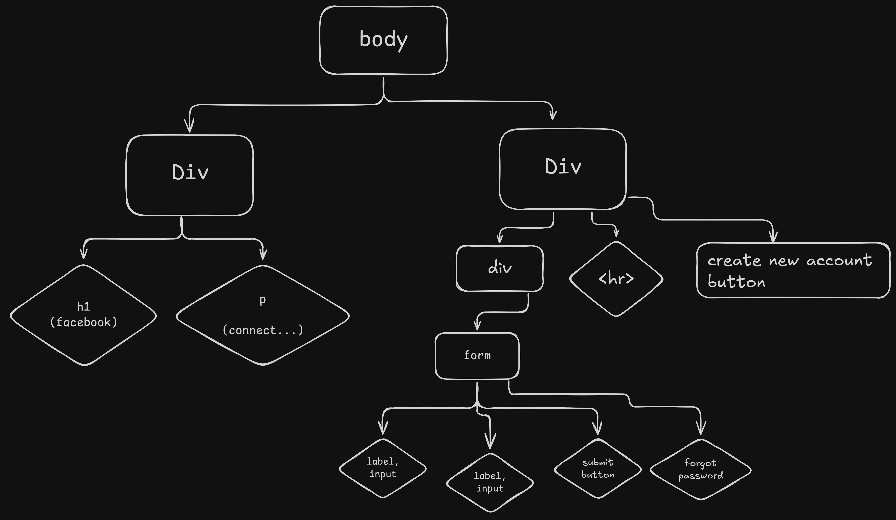

# 🔐 HTML + CSS Assignment: Login Page

Dear Students,  
In this assignment, you will create a **Login Page** based on the screenshot provided.

👉 Carefully observe the screenshot (`login.png`) and build the same layout using **HTML + CSS**.

---

## 📷 Screenshot Reference

---

## 🔊 Instructions in Voice

<audio controls>
  <source src="./instructions.mp3" type="audio/mpeg">
  Your browser does not support the audio element.
</audio>

---

## HTML Structure

Here's your **html** structure

## ✅ Final Reminder

✍️ Submit your `.html` file styled with CSS.
