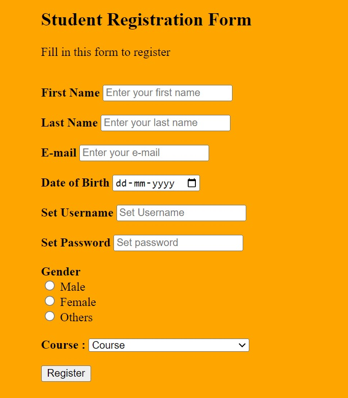

# 📄 Today Exam Topic: **Simple HTML Form**
Time *40 minutes*
## 🔸 Assignment 1:
Create same as in the picture

⚠️ background yellow nahi karna


### ✅ Hint:
- For `Course` input use this code
```html
    <label for="mySelect">Choose an option:</label>
    <select id="mySelect" name="myOption">
    <option value="option1">Option 1 Text</option>
    <option value="option2">Option 2 Text</option>
    <option value="option3">Option 3 Text</option>
    </select>
```
- For `Date` input use this code
```html
    <input type="date" name="date">
```


---
## 🔸 Assignment 2: **Simple HTML Form**
 

### Objective:
Create a basic form to collect user feedback.
 

### Requirements:
- Use `<form>` tag.
- Include input fields for:
  - Name
  - Email
  - Age (number input)
  - Feedback (textarea)
  - Gender (radio buttons)
  - Favorite Color (dropdown with `<select>`)
- A submit button

---
