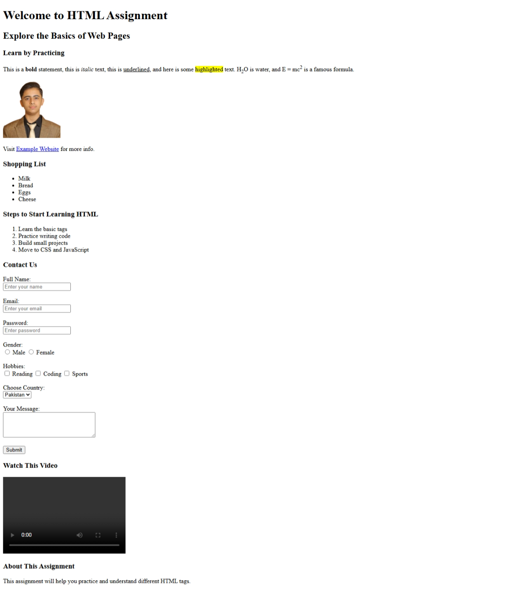

# 📌 HTML Assignment

Time _50 minutes_

## 🔸 Assignment 1:

Dear Students,  
Your task is to **recreate the given webpage** by writing the HTML code yourself.

👉 Carefully observe the screenshot (attached as `screenshot`) and write the HTML code that produces the same output.  
👉 Do **not copy-paste** any template — write it from scratch.  
👉 Make sure to include all the elements you see in the screenshot.

---

## 🎯 Instructions

1. Use **only HTML**
2. Try to keep indentation proper and clean.
3. Submit your `.html` file once completed.

---

## 📷 Screenshot Reference

---

## Bonus Tip

Use `<mark></mark>` to hightlight

## ✅ Hints

Your HTML should include:

- Headings (`<h1>…<h6>`)
- Paragraphs with inline formatting (`<b>`, `<i>`, `<u>`, `<mark>`, ``, ``)
- Image (``)
- Link (`<a>`)
- Unordered and Ordered Lists (`<ul>`, `<ol>`, `<li>`)
- Form elements (`<input>`, `<textarea>`, `<select>`, radio, checkbox, submit)
- Video (`<video>`)
- Div & Span (`
`)

---

✍️ **Your Task**: Write the full HTML code to match the screenshot.
