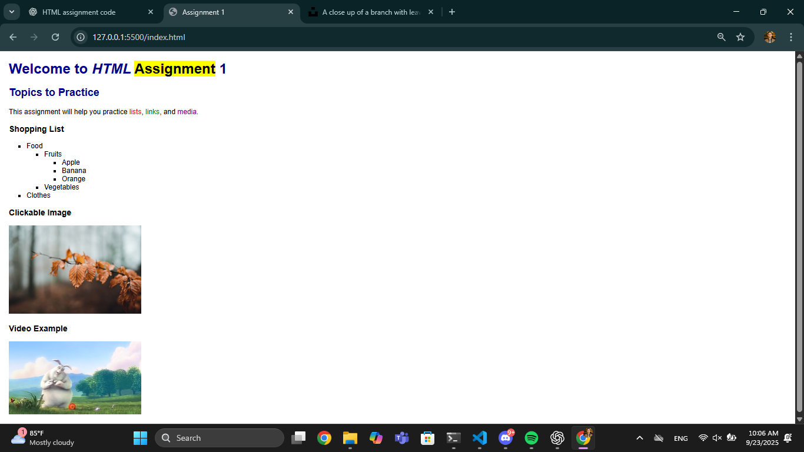
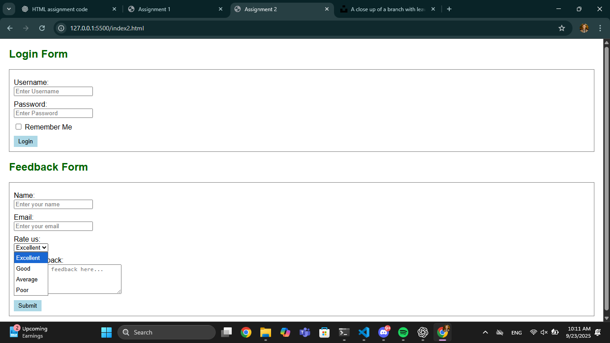

# 📌 HTML Assignments

Dear Students,  
You have **two assignments**. Each one is based on a screenshot.  
👉 Look carefully at the screenshots and write the **HTML (and very basic CSS where required)** code to produce the same result.  
👉 Do **not use semantic tags** (`<header>`, `<footer>`, `<section>`, `<article>`).  
👉 Do **not use tables**.

---

## 📝 Assignment 1

### Instructions

1. Keep indentation clean and organized.
2. Use proper attributes (`alt`, `title`, `placeholder`).
3. Submit your `.html` file once done.

### Assets

- **Image:** https://unsplash.com/photos/a-close-up-of-a-branch-with-leaves-HbkzVNT2i_M
- **Video:** https://www.w3schools.com/html/mov_bbb.mp4

---

## 📝 Assignment 2

### Instructions

1. Use **HTML + very basic CSS** (inside `<style>` in `<head>`).
2. CSS should be **minimal** (background, font, colors, margins, etc.).
3. Use proper attributes (`alt`, `title`, `placeholder`, `required`).
4. Submit your `.html` file once done.

---

## ✅ Reminder

Both assignments should include:

- Headings with inline formatting.
- Lists (ordered, unordered, nested).
- Links (text and image links).
- Forms with inputs, checkboxes, textarea, dropdown.
- Media (image, video).
- Use of `
` and `` for grouping.

---

✍️ **Your Task:** Write the HTML (and basic CSS where required) for each screenshot and submit both files.
