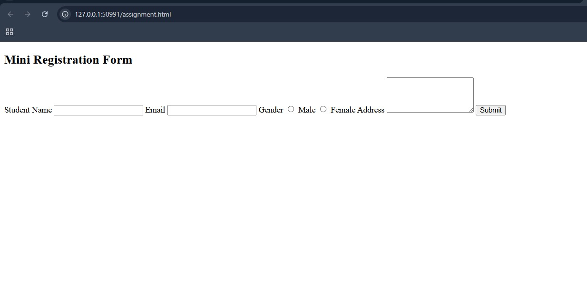

# 🧑‍🏫 HTML Form Elements: `label` aur `input`

## 📌 Introduction

Form bananay ka maqsad yeh hota hai ke user kuch data type kar sake — jaise ke apna naam, email, ya phone number. Is data ko collect karne ke liye hum HTML ke `label` aur `input` elements ka use karte hain.

---

## 🔤 `label` Kya Hota Hai?

`label` ek tag hota hai jo kisi input field ka **naam ya description** dikhata hai.

```html
<label>Student Name</label>
```

Yeh user ko batata hai ke neeche wala box kis cheez ke liye hai.

---

## ⌨️ `input` Kya Hota Hai?

`input` ek field hota hai jahan user kuch likh sakta hai — jaise naam, number, ya email.

```html
<input type="text">
```

Yeh ek **text field** banata hai jahan user koi bhi text likh sakta hai.

---

## 🧩 `label` aur `input` ka Combination

Dono ko sath use karte hain takay form samajhne mein asaani ho.

```html
<label>Student Name</label><br>
<input type="text">
```

> 🗣️ *Iska matlab: "Student Name" ka label dikhega, aur neeche ek box hoga jisme user apna naam likhega.*

---

## 🔐 Example: Email Field

```html
<label>Email ID</label><br>
<input type="email">
```

Yeh user se email mangta hai. Browser check karega ke email theek format mein hai ya nahi.

---

## 🔘 Radio Button ke sath `label`

```html
<label>Gender</label><br>
<input type="radio" name="gender"> Male
<input type="radio" name="gender"> Female
```

User ko option milta hai ke wo apna gender choose kare.

---

## 📋 Complete Chhota Form Example

```html
<form>
    <label>Full Name</label><br>
    <input type="text"><br><br>

    <label>Email</label><br>
    <input type="email"><br><br>

    <label>Gender</label><br>
    <input type="radio" name="gender"> Male
    <input type="radio" name="gender"> Female<br><br>

    <input type="submit" value="Submit">
</form>
```

---

## 📖 Recap (Akhri Nazar Mein)

| Tag           | Kaam                                |
|---------------|-------------------------------------|
| `<label>`     | Field ka naam ya title dikhata hai  |
| `<input>`     | Field jisme user kuch likhta hai    |
| `type="text"` | Simple text ke liye                 |
| `type="email"`| Email address ke liye               |
| `type="radio"`| Option choose karne ke liye         |
| `name=""`     | Group ya field ka naam (radio mein zaroori) |

---

## 🎓 Tip for Students

- Har `input` ke sath `label` lagana **best practice** hai.
- `label` readability aur accessibility dono ke liye acha hota hai.

---


# 🎯 Student Tasks: HTML `label` aur `input`

## 👨‍🏫 Instructions

Niche diye gaye har task ko complete karo apne HTML editor (Notepad / VS Code / CodePen) mein. Har task ke baad apne code ko run karke dekho ke sahi kaam kar raha hai ya nahi.

---


## ✅ Task 1: Gender Selection (Radio Buttons)

1. Ek label banao: `Gender`
2. Do radio buttons banao — `Male` aur `Female`
3. Dono radio buttons ka `name="gender"` hona chahiye takay ek waqt mein sirf ek select ho

📝 **Example:**
```html
<label>Gender</label>
<input type="radio" name="gender"> Male
<input type="radio" name="gender"> Female
```

---


## ✅ Task 2: Mini Form Create Karo

Aik mini registration form banao jisme ye fields hon:

- Student Name (text)
- Email (email)
- Gender (radio)
- Address (textarea)
- Submit Button

**For Example:**



---

## 📌 Bonus Task: Required Fields

Form ke input fields mein `required` attribute lagao takay user bina bharay form submit na kar sake.

📝 **Example:**
```html
<input type="text" required>
```

---

## ✅ Submission Guide

- Apna complete HTML code ek file mein save karo: `form-task.html`
- Run karke check karo sab inputs sahi kaam kar rahe hain
- File teacher ko submit karo ya class ke GitHub repo mein upload karo (agar applicable ho)

---

## 🔚 End of Task Sheet

Good luck! 💪 Practice se hi perfection aata hai!
